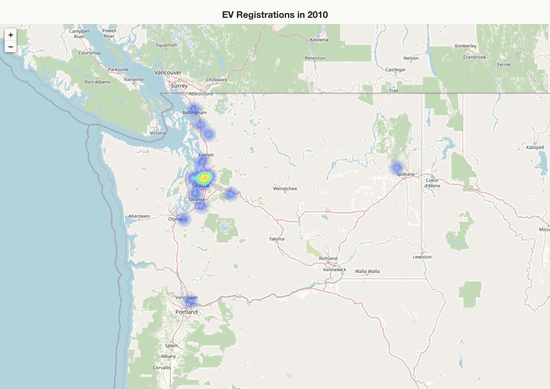
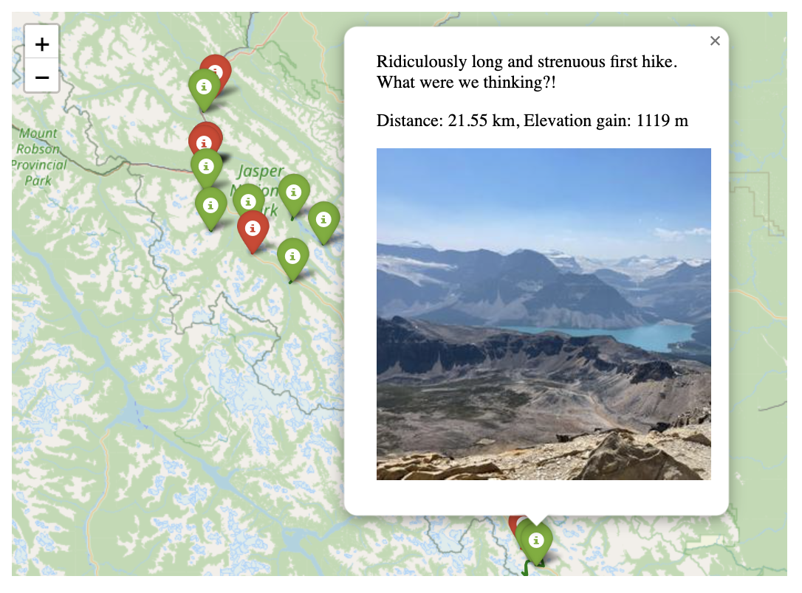
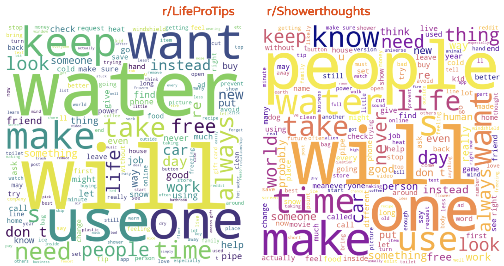
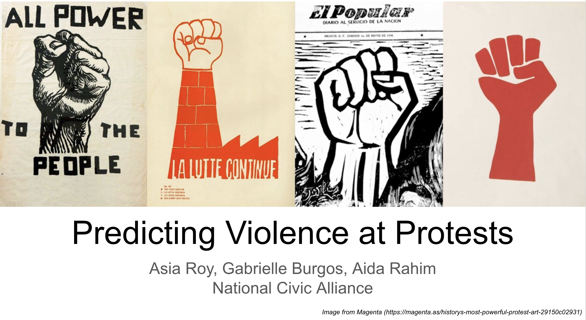
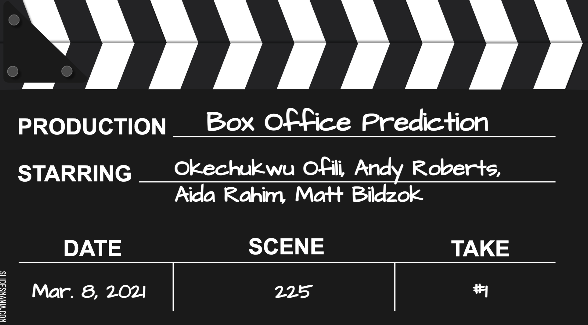

## Portfolio

---

### Electrification of Transportation

[EVs: Access and Opportunity](https://github.com/aidarahim/Electric_Vehicle_Access)

---

### Track, Map, Share

[Adventures in the Canadian Rockies](https://github.com/aidarahim/strava_rockies)

---

### NLP Classification 

[When to Retrain ML Model?](https://github.com/aidarahim/Classification_Model_Retraining/tree/main/Classification_Model_Retraining)

---

### Supporting Civic Duty

[Predicting Violence at Protests](https://github.com/aidarahim/Predict_Protest_Violence)

---

### Hackerthon

[Box Office Revenue Prediction](https://github.com/aidarahim/Hackathon_Box_Office_Revene)

---

---

Page template forked from <a href="https://github.com/evanca/quick-portfolio">evanca</a>

<!-- Remove above link if you don't want to attibute -->
